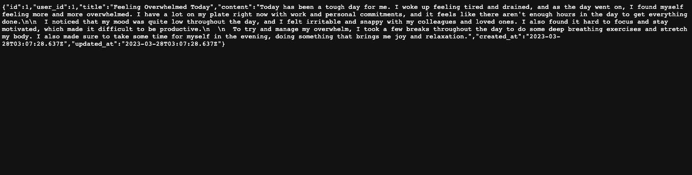

# README

# Mental Health API

Mental Health API is a backend API for a mental health platform, built using Ruby on Rails. This API provides a database and authentication for the frontend, as well as endpoints for managing journal entries, moods, and positive quotes.

### Table of Contents

### [Installation](#Installation) - [Usage](#Usage) - [Enpoints](#Endpoints) - [Authetication](#Authetication)

---

## Installation <a name="Installation"></a>

To install and run Mental Health API locally, follow these steps:

**Install dependencies**:

- rack-cors: for Cross-Origin Resource Sharing (CORS) configuration
- jwt: for JSON Web Token (JWT) authentication
- httparty: for making HTTP requests

  **Install gems** -
  **Create database** -
  **Run migrations** -
  **Start server** -

  ```ruby
  bundle install
  rails db:create
  rails db:migrate
  rails db:seed
  rails server
  ```

Clone the repository: git clone https://github.com/JoseMRodriguezO/mental-health-api.git

## Usage <a name="Usage"></a>

Mental Health API provides endpoints for managing journal entries, moods, and positive quotes. To use the API, you can send requests to the endpoints described in the next section using an HTTP client such as cURL or Postman.

## Enpoints <a name="Enpoints"></a>

Mental Health API provides the following endpoints:


## _Journal Entries_

GET /journal_entries: Returns a list of all journal entries.
GET /journal_entries/:id: Returns a specific journal entry by ID.
POST /journal_entries: Creates a new journal entry.
PATCH /journal_entries/:id: Updates an existing journal entry.
DELETE /journal_entries/:id: Deletes a journal entry by ID.

## _Moods_

GET /moods: Returns a list of all moods.
POST /moods: Creates a new mood.

## _Positive Quotes_

GET /positive_quotes: Returns a random positive quote.
For a complete list of endpoints, see the API documentation.

## Authetication <a name="Authetication"></a>

To authenticate with the API, you can create a user account by sending a POST request to the /users endpoint with a JSON body containing your desired username and password.

To login, send a POST request to the /sessions endpoint with a JSON body containing your username and password. The response will include an auth_token that you can use to authenticate subsequent requests by including it in the Authorization header.
